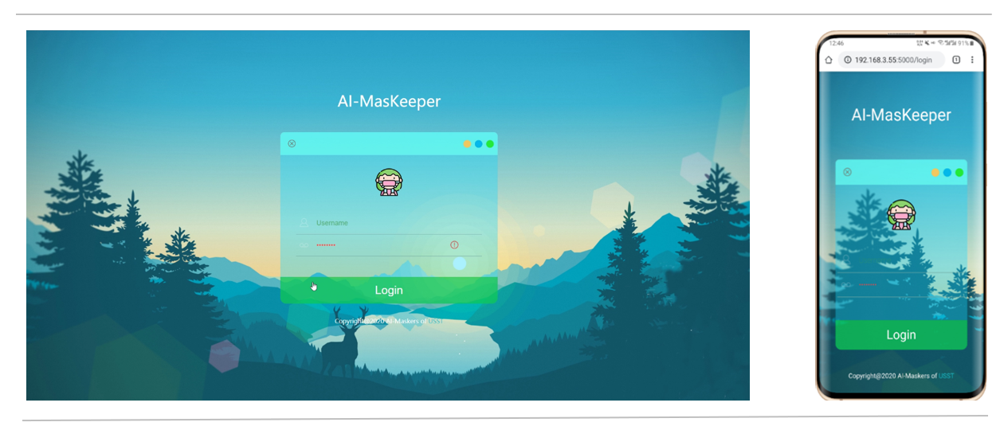
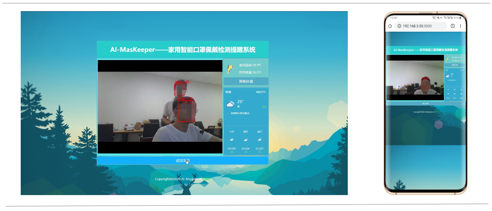
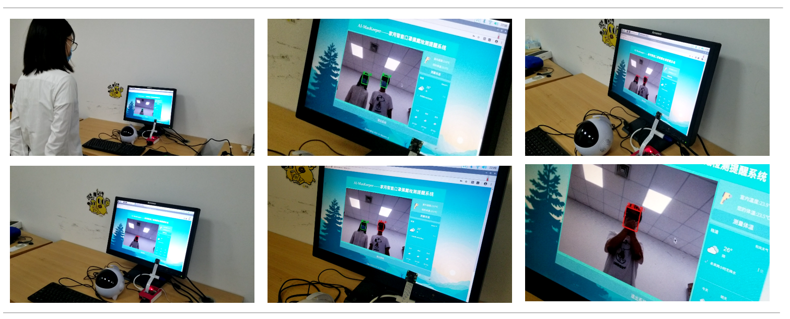
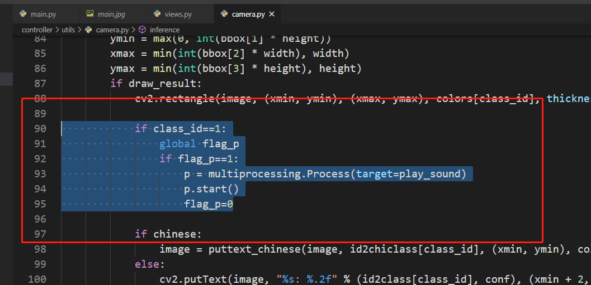

# **AI-MasKeeper——口罩佩戴检测系统（20200803）**

> 本项目**实用意义不大**，故在此开源。
>
> 一个用来参加研究生电子设计竞赛的项目😂

## 简单功能介绍

- 利用树莓派3B结合树莓派摄像头，实现**人脸口罩佩戴检测**；
- 搭配红外温度传感器模块MLX90614，实现**体温测量**；
- 通过调用和风天气API，获取实时**天气信息**。
- Flask搭建**网页**前端，实时显示各项信息。

## 项目实现原理：

- 就是这里下载一个开源项目，那里下载一个开源项目，然后拼凑在了一起……
- 口罩检测的模型是别人设计的，从[知乎](https://zhuanlan.zhihu.com/p/107719641)上看到，写得很详细。
- 模型是别人训练好的，读取是利用OpenCV的DNN模块，OpenCV读取模型的工程来自[这里](https://github.com/hpc203/FaceMaskDetection-dnn)。
- 树莓派串口连接红外温度传感器，[读取的程序](https://github.com/SFXRescue/PyMLX90614)也是拿的别人的。
- [Flask搭建的流媒体客户端](https://github.com/Kr1s77/flask-video-streaming-recorder)，当然也是直接用了别人写的，自己美化修改了一下，添加了一些自己需要的功能。
- 天气预报的模块要放上去最简单了，直接[和风天气](https://dev.heweather.com/widget/standard)里面创建，复制代码粘贴到自己的工程。

## 运行环境：

- Python 3
- OpenCV
- Flask
- numpy
- pygame
- pillow

## 可以运行在自己的笔记本上，默认调用笔记本的摄像头进行检测

- **系统默认登录用户名及密码都是：admin**

- 笔记本上面运行还是比较流畅的

- **语音提示功能：**在自己的笔记本上运行的时候，可以调用Pygame播放**提示音**（但我能力有限，仅仅是写了一个只会运行一次的判断，hhh，也就是程序运行后有一帧没有戴口罩的画面的话，就会播放一次提示音……还想再播放的话，就得关掉程序重新启动了😂，让人怪不好意思的）

## 若运行在树莓派上：则要修改部分代码：

因为我也没有优化代码，直接就是移植到树莓派上，所以运行的时候，延迟比较明显（所以说没有什么实用意义），无法满足实时性。

树莓派上其实跟笔记本上是一样的，笔记本上装OpenCV很方便，树莓派我是按照[教程](https://www.pyimagesearch.com/2019/09/16/install-opencv-4-on-raspberry-pi-4-and-raspbian-buster/)自己编译源代码的，树莓派3B的性能比较弱，放在一遍编译了几个小时才弄好，并且发热很严重，所以运行程序的时候记得开空调。

连接了MLX90614模块的话，需要[下载PyMLX90614](https://github.com/SFXRescue/PyMLX90614)可以获取传感器的温度信息。

## 项目使用方法：

安装所需环境之后，运行工程文件，主程序：main.py，浏览器打开：**localhost:5000** 即可进入系统的网页端。

## **参考：**

- 开源人脸口罩检测知乎文章：https://zhuanlan.zhihu.com/p/107719641
- 开源的人脸口罩检测模型：https://github.com/AIZOOTech/FaceMaskDetection
- OpenCV读取口罩检测模型：https://github.com/hpc203/FaceMaskDetection-dnn
- 树莓派上编译OpenCV的教程：https://www.pyimagesearch.com/2019/09/16/install-opencv-4-on-raspberry-pi-4-and-raspbian-buster/
- WEB页面所使用开源项目：https://github.com/Kr1s77/flask-video-streaming-recorder
- 温度传感器读取模块：https://github.com/SFXRescue/PyMLX90614
- 和风天气插件创建：https://dev.heweather.com/widget/standard

**如果对你有用的话，可以在Github上面给我一个小⭐哦！**

